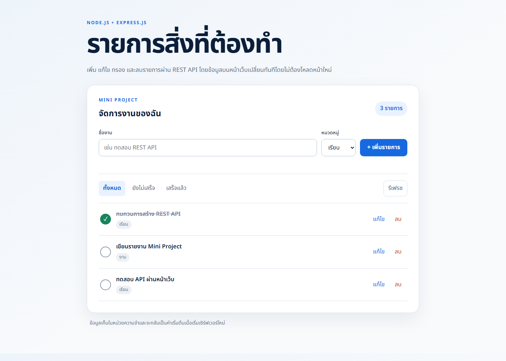
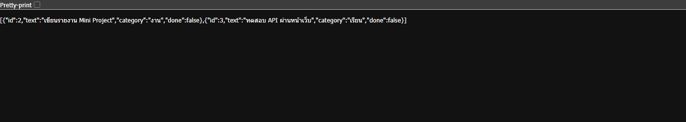

# Mini Project - Task Manager REST API

เว็บแอปพลิเคชัน Full-stack สำหรับจัดการรายการสิ่งที่ต้องทำ พัฒนาด้วย Node.js, Express.js, HTML, CSS และ JavaScript หน้าเว็บเรียก REST API ด้วย `fetch()` โดยไม่ต้องโหลดหน้าใหม่

## ความสามารถ

- แสดงรายการทั้งหมดและกรองตามสถานะเสร็จ/ยังไม่เสร็จ
- เพิ่มรายการพร้อมเลือกหมวดหมู่
- แก้ไขชื่อ หมวดหมู่ และสถานะ
- ลบรายการ
- ตรวจสอบข้อมูลก่อนบันทึก พร้อมแสดงสถานะกำลังโหลด ข้อผิดพลาด และไม่มีข้อมูล

## วิธีติดตั้งและเปิดใช้งาน

ต้องติดตั้ง Node.js ก่อน จากนั้นเปิด Terminal ในโฟลเดอร์โปรเจกต์แล้วใช้คำสั่ง

```bash
npm install
npm run dev
```

เปิดเว็บที่ <http://localhost:3001>

## REST API

| Method | Endpoint | การทำงาน | สถานะสำเร็จ |
|---|---|---|---|
| GET | `/api/tasks` | ดูรายการทั้งหมด | 200 |
| GET | `/api/tasks?done=true` | กรองรายการตามสถานะ | 200 |
| GET | `/api/tasks?category=เรียน` | กรองรายการตามหมวดหมู่ | 200 |
| GET | `/api/tasks/:id` | ดูรายการตาม ID | 200 |
| POST | `/api/tasks` | เพิ่มรายการ | 201 |
| PATCH | `/api/tasks/:id` | แก้ไขชื่อ หมวดหมู่ หรือสถานะ | 200 |
| DELETE | `/api/tasks/:id` | ลบรายการ | 204 |

API จะตอบ `400` เมื่อข้อมูลไม่ถูกต้อง และตอบ `404` เมื่อไม่พบรายการ

ตัวอย่างข้อมูลสำหรับเพิ่มรายการ:

```json
{
  "text": "ทดสอบ REST API",
  "category": "เรียน"
}
```

## โครงสร้างโปรเจกต์

```text
Mini Project/
|-- package.json
|-- package-lock.json
|-- server/
|   `-- app.js
|-- public/
|   |-- index.html
|   |-- style.css
|   `-- app.js
|-- docs/
|   |-- screenshots/
|   `-- Mini-Project-Report.pdf
`-- README.md
```

## ภาพการทำงาน

### ภาพการทำงานของหน้าเว็บ



### ภาพผลลัพธ์จาก GET พร้อม Query String

เรียก `/api/tasks?done=false` เพื่อแสดงเฉพาะรายการที่ยังไม่เสร็จ



## หมายเหตุ

ข้อมูลเก็บไว้ในหน่วยความจำ จึงกลับเป็นข้อมูลตัวอย่างเมื่อเริ่มเซิร์ฟเวอร์ใหม่ GitHub Pages ไม่สามารถรันเซิร์ฟเวอร์ Node.js ได้ ผู้ตรวจสามารถดาวน์โหลด Repository แล้วเปิดตามขั้นตอนด้านบน
